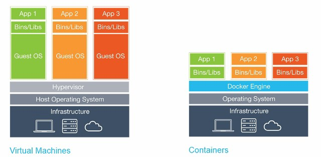
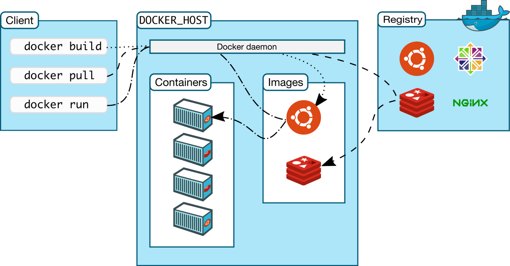

# Mengenal Docker dan Container

Kali ini saya akan membahas tentang Apa itu Container dan Docker.

## Container
Apa sih Container itu ? dalam bahasa kita mengartikan container sebagai wadah. Yup, kasarnya Container ini zadalah paket / aplikasi yang mengandalkan isolasi virtual untuk menjalankan aplikasi yang dapat menjalankan sistem operasi kernel secara simultan tanpa memerlukan mesin virtual (VMs).

Perbedaanya apa ?? bisa dilihat dari arsitektur gambar diatas bahwa pada virtual machines terdapat Hypervisor pada arsitekturnya dan blok VM terdiri dari app, file lib dan binary serta seluruh bagian guest operating system. Sedangkan pada arsitektur container terdapat docker engine yang digunakan untuk menjalankan docker container serta pada container itu terdiri dari app dan semua dependasinya.

## Docker
Docker adalah sebuah project open source yang ditujukan untuk developer atau sysadmin untuk membangun, mengemas, dan menjalankan aplikasi dimana pun di dalam sebuah container. Nah Tugas utama Docker sudah jelas, sebagai Aplikasi yang bisa memanajemen Container kita nantinya, mulai dari Membuat, menghapus sebuah Container atau Menjalankan, Memulai Ulang, Menghentikan Container.

Fungsi utama Docker adalah menyederhanakan konfigurasi yang dibangun berdasarkan teknologi container.

### Docker Daemon
Docker daemon (dockerd) mendengarkan permintaan Docker API dan mengelola objek Docker seperti images, container, network, dan volume.

### Docker Object
- Images 
- Container
- Services 

### Docker Registry
Tempat terpusat bagi tim Anda untuk mengelola image Docker.

## Refrensi
- https://docs.docker.com/
- https://www.cloudmatika.co.id/blog-detail/perbedaan-antara-vm-virtual-machine-dengan-container
- https://medium.com/@viandwi24/belajar-docker-mengenal-apa-itu-docker-dan-container-container-vs-virtual-machine-3c20d7288224
- https://www.ekrut.com/media/mengenal-docker-dan-penggunaannya-seperti-apa-sih
